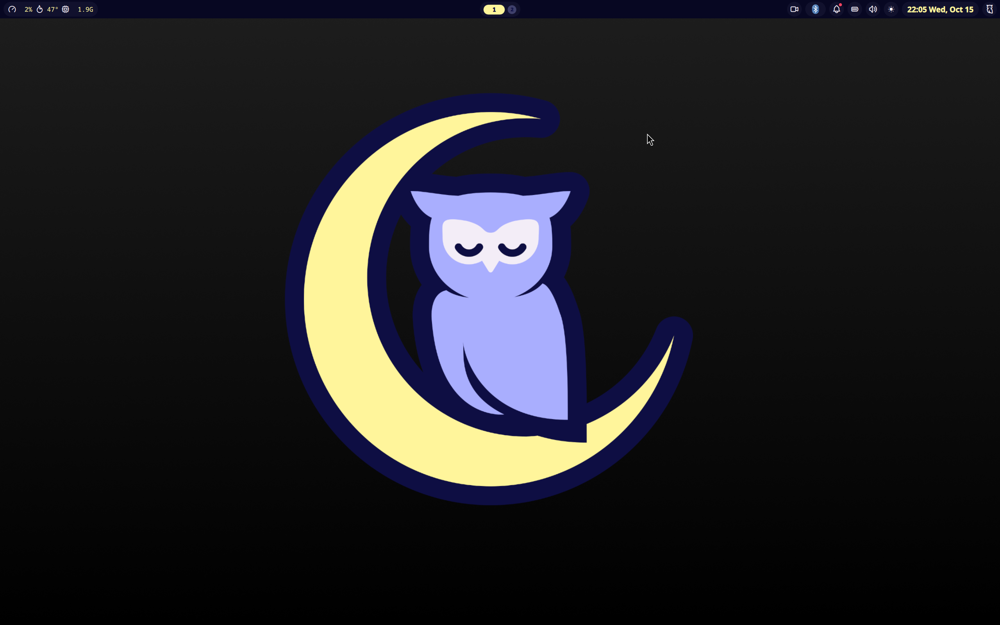
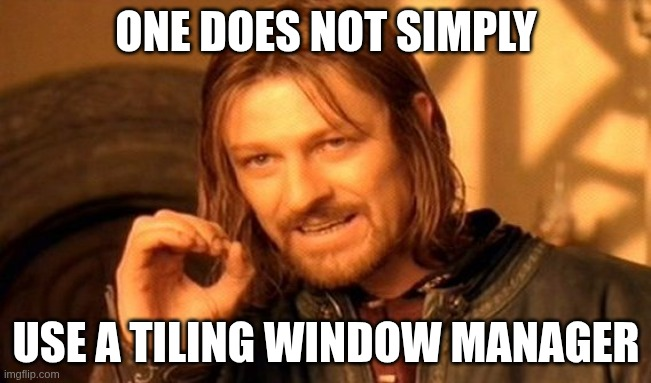

# Mordor
[](https://github.com/noelmiller/mordor/actions/workflows/build.yml)





Custom Fedora Atomic Image for Desktops and Laptops. This image ships the [Niri Window Manager](https://github.com/YaLTeR/niri). I have tried to make it as easy to use out of the box as possible.

**Note: I do not have images for Nvidia. I may add them if there is demand.**

# Purpose

This is an image that is built on the work of [Universal Blue](https://github.com/ublue-os) and Fedora Atomic.

The `Containerfile` is built directly off of [base-main](https://github.com/ublue-os/main).

**This image is very beta and is changing rapidly. I will hopefully make it more general purpose in the future, but for now it is very much a personal image.**

If you want images designed for general consumption, I suggest using [Bazzite](https://github.com/ublue-os/bazzite) or [Bluefin](https://github.com/ublue-os/bluefin) from the Universal Blue project.

# Features

These are the features included in my image!

## Packages

The full list of rpm packages can be found in [install_packages.sh](scripts/install_packages.sh).

The full list of flatpaks can be found in [mordor_flatpaks](flatpaks/mordor_flatpaks)

## Configuration

The image is built out of several components to create a cohesive desktop experience. The main components are:

- [Niri](https://github.com/YaLTeR/niri)
- [Alacritty](https://github.com/alacritty/alacritty)
- [Fuzzel](https://codeberg.org/dnkl/fuzzel)
- [Mako](https://github.com/emersion/mako)
- [Swaylock](https://github.com/swaywm/swaylock)
- [Waybar](https://github.com/Alexays/Waybar)

The default configuration files are in the `/etc/skel` directory except for the `niri` configuration file which is in `/etc/niri`.

### Niri

The window manager! It is a scrolling window manager which makes it unique among tiling window managers.

The Niri configuration file is located at `/etc/niri/config.kdl`. This file contains the default configuration for the Niri window manager. You can customize it to your liking. The main thing you will likely want to change is either keybindings or display settings. Information for this can be found in the [Niri documentation](https://github.com/YaLTeR/niri/wiki/Configuration:-Introduction).

### Alacritty

The default terminal emulator. It is a GPU-accelerated terminal emulator that is fast and lightweight.

The default configuration files are located at `/etc/skel/.config/alacritty/alacritty.toml` and `/etc/skel/.config/alacritty/catppuccin-mocha.toml` and will be copied into your home directory. Do not edit these files directly. Instead, copy them to your home directory and edit them there. The default theme is Catppuccin Mocha, but you can change it to any theme you like. The [Alacritty documentation](https://github.com/alacritty/alacritty/blob/master/README.md#configuration) has more information on how to customize your configuration.

### Fuzzel

Fuzzel is a lightweight, fast, and highly customizable application launcher. It is used to launch applications and switch between them.

The default configuration file is located at `/etc/skel/.config/fuzzel/fuzzel.ini` and will be copied into your home directory. Do not edit this file directly. Instead, copy it to your home directory and edit it there. The [Fuzzel documentation](https://codeberg.org/dnkl/fuzzel) has more information on how to customize your configuration.

### Mako

Mako is a notification daemon that is designed to be simple and fast. It is used to display notifications from applications.

The default configuration file is located at `/etc/skel/.config/mako/config` and will be copied into your home directory. Do not edit this file directly. Instead, copy it to your home directory and edit it there. The [Mako documentation](https://github.com/emersion/mako) has more information on how to customize your configuration.

### Swaylock

Swaylock is a screen locker. It is used to lock the screen when you are away from your computer.

The default configuration file is located at `/etc/skel/.config/swaylock/config` and will be copied into your home directory. Do not edit this file directly. Instead, copy it to your home directory and edit it there. The [Swaylock documentation](https://github.com/swaywm/swaylock) has more information on how to customize your configuration.

### Waybar

Waybar is a highly customizable status bar for Wayland compositors. It is used to display system information, notifications, and other information in a bar at the top of the screen.

The default configuration file is located at `/etc/skel/.config/waybar/config.jsonc` and the default style files are located at `/etc/skel/.config/waybar/style.css` and `/etc/skel/.config/waybar/mocha.css`. Both will be copied into your home directory. Do not edit these files directly. Instead, copy them to your home directory and edit them there. The [Waybar documentation](https://github.com/Alexays/Waybar) has more information on how to customize your configuration.

## Cockpit

I do not enable cockpit by default as I use this image on my laptop as well.

### Caveat

Cockpit is not installed in the traditional way it normally is on Fedora Workstation. It must be run in a container. You can still run it as a service on boot, but the install method is different.

### Install and Configure Cockpit

Here are the steps required:

1. Run the Cockpit web service with a privileged container (as root):

`podman container runlabel --name cockpit-ws RUN quay.io/cockpit/ws`

2. Make Cockpit start on boot (as root):

`podman container runlabel INSTALL quay.io/cockpit/ws`

`systemctl enable cockpit.service`

The full documentation for cockpit can be found [here](https://cockpit-project.org/running.html#coreos).

## Using the Image

If you do decide you want to try my image, you will want to rebase from Fedora Kinoite (or Silverblue) using this command:

```bash
rpm-ostree rebase ostree-unverified-registry:ghcr.io/noelmiller/mordor:latest
```

After rebase, you will need to run the command below to install all flatpaks that are shipped with Mordor:

```bash
ujust _install-mordor-flatpaks
```

I would recommend creating a new user after the rebase because there are several files in /etc/skel that you will want in your home directory. The other option is just to copy the files from /etc/skel into your home directory. You will specifically want the `.config` directory.

## Verification

These images are signed with sigstore's [cosign](https://docs.sigstore.dev/cosign/overview/). You can verify the signature by downloading the `cosign.pub` key from this repo and running the following command:

```bash
cosign verify --key cosign.pub ghcr.io/noelmiller/mordor
```

## Special Thanks

The contributors at Universal Blue and Fedora are amazing. This image would not exist without the incredible work they do every day!
